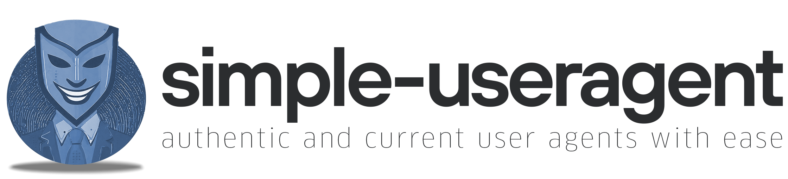

<!--- Logo -->

  
<picture>
  <source media="(prefers-color-scheme: dark)" srcset="./img/banner_dark.png" width="600vw">
  <source media="(prefers-color-scheme: light)" srcset="./img/banner_light.png" width="600vw">
  
</picture>

 

<!--- Badges -->

 
  <a href="https://github.com/Lennolium/1Guard-ai/branches" > 
    
    
   <a href="https://app.codacy.com/gh/Lennolium/swiftGuard/dashboard?utm_source=gh&utm_medium=referral&utm_content=&utm_campaign=Badge_grade" > 
    
    
   <a href="https://github.com/Lennolium/1Guard-ai/commits/main" > 
    
     
  <a href="https://github.com/Lennolium/1Guard-ai/releases" > 
    
      
  <a href="https://github.com/Lennolium/1Guard-ai/issues" > 
    
  <a href="https://github.com/Lennolium/1Guard-ai/issues?q=is%3Aissue+is%3Aclosed" > 
     
     <a href="#" > 
    
  <a href="https://github.com/Lennolium/1Guard-ai/blob/main/LICENSE" > 
     
   </a> </a> </a> </a> </a> </a> </a> </a>

<!--- Title -->

  <h1></h1> 

<!--- Description -->

1Guard-ai functions as a robust backend system integrated with a macOS Safari plugin, designed to analyze 
the security level of shopping websites accessed by users. Using the Flask framework in Python, the backend receives domain and 
user IP data from the Safari plugin via HTTPS requests. It leverages Scrapy for comprehensive website scraping and 
analysis, inspecting crucial aspects such as the presence of an imprint and the quality of the content's language. 
The system employs MongoDB for efficient data storage, offering quick access to previously scanned domains and their 
corresponding security scores. With a focus on scalability, the backend architecture is organized into distinct 
modules, including an API, a controller, an AI module, a website scanning module, and a database manager, 
facilitating streamlined data handling and processing. The application integrates various security features such 
as TLS certificate usage and rate limiting to ensure secure and optimized operations. 

  

  <h3></h3>  
    
     
&nbsp;

<!--- Table of contents -->

## Contents

- [Features](#features)
- [Screenshots](#screenshots)
- [Why should you care?](#why-should-you-care)
- [Installation](#installation)
- [Usage](#usage)
- [Development](#development)
- [Roadmap](#roadmap)
- [Contributors](#contributors)
- [Credits](#credits)
- [License](#license)

&nbsp;

<!--- Features -->

## Features

- __Monitoring:__ Continuously monitors visited websites and protects against 
  fraud and scam.
- __Feedback:__ Allows users to give feedback on websites and their security scores.
- __Discrete:__ Operates in the safari menu, minimizing 
  interruptions.
- __Customizable:__ Allows users to configure various settings.
- __Lightweight:__ Designed to consume minimal system resources for optimal 
   performance.
- __Privacy:__ Only transmits the URL without path or parameters.
- __Open Source:__ Provides transparency and 
  allows community contributions for continuous development.

&nbsp;

<!--- Screenshots -->

## Screenshots
TODO
<!---

  
<picture>
  <source srcset="./img/screenshots.png" width="600vw">
  
</picture>
  
*__Left:__ Lorem ipsum. __Right:__ Lorem ipsum.*

 
-->
&nbsp;

<!--- Why -->

## Why should you care?

A few reasons to use this plugin:

TODO
&nbsp;

<!--- Installation -->

## Installation

TODO
&nbsp;

<!--- Usage -->

## Usage

&nbsp;

<!--- Development -->

## Development

As an open-source project, I strive for transparency and collaboration in my development process. I greatly 
appreciate any contributions members of our community can provide. Whether you are fixing bugs, proposing features, 
improving documentation, or spreading awareness - your involvement strengthens the project. Please review the 
[code of conduct](https://github.com/Lennolium/1Guard-ai/blob/main/.github/CODE_OF_CONDUCT.md) to understand how we work together 
respectfully.

- __Bug Report:__ If you are experiencing an issue while using the application, please [create an issue](https://github.com/Lennolium/1Guard-ai/issues/new/choose).
- __Feature Request:__ Make this project better by [submitting a feature request](https://github.com/Lennolium/1Guard-ai/discussions/2).
- __Documentation:__ Improve our documentation by [adding a wiki page](https://github.com/Lennolium/1Guard-ai/wiki).
- __Community Support:__ Help others on [GitHub Discussions](https://github.com/Lennolium/1Guard-ai/discussions).
- __Security Report:__ Report critical security issues via our [template](https://github.com/Lennolium/1Guard-ai/blob/main/.github/SECURITY.md).

&nbsp;

<!--- Roadmap -->

## Roadmap

| **Now**               | **Next**                                             | **Later**                   |
|-----------------------|------------------------------------------------------|-----------------------------|
| Unit tests            | Linux and Windows support                            | CI/CD                       |
| Code quality          | Auto update                                          | Website/Docs/Wiki           |
| Cross browser support | Translations                                         | Code sign (Apple) |

&nbsp;

<!-- Contributors -->

## Contributors

Thank you so much for giving feedback, implementing features and improving the code and project!

&nbsp;

<!--- Credits -->

## Credits

TODO

Many more credits are in the [acknowledgments](https://github.com/Lennolium/1Guard-ai/blob/main/ACKNOWLEDGMENTS) file.

&nbsp;

<!--- License -->

## License

Provided under the terms of the [GNU GPL3 License](https://www.gnu.org/licenses/gpl-3.0.en.html) © Lennart Haack 2023.

See [LICENSE](https://github.com/Lennolium/1Guard-ai/blob/main/LICENSE) file for details.
For the licenses of used third party libraries and software, please refer to the [ACKNOWLEDGMENTS](https://github.com/Lennolium/1Guard-ai/blob/main/ACKNOWLEDGMENTS) file.

